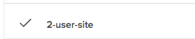

# JavaScript Demonstration Scripts

[](https://circleci.com/gh/saucelabs-training/demo-js)

The demo scripts in [this repository](https://github.com/saucelabs-training/demo-js) allow you to run simple automated tests in order to validate your JavaScript test environment and your [saucelabs.com](https://app.saucelabs.com/login) account credentials.
> ###### Disclaimer
>
> The code in these scripts is provided on an "AS-IS" basis without warranty of any kind, either express or implied, including without limitation any implied warranties of condition, uninterrupted use, merchantability, fitness for a particular purpose, or non-infringement. These scripts are provided for educational and demonstration purposes only, and should not be used in production. Issues regarding these scripts should be submitted through GitHub. These scripts are maintained by the Technical Services team at Sauce Labs.
>
>Some examples in this repository, such as `appium-examples` and `headless-examples`, may require a different account tier beyond free trial. Please contact the [Sauce Labs Sales Team](https://saucelabs.com/contact) for support and information.

<br />

## Solution Outline
* [Tests that can help you quickly and easily get started with Sauce Labs](https://github.com/saucelabs-training/demo-js/blob/master/on-boarding-modules)
* [W3C examples using Sauce Labs](https://github.com/saucelabs-training/demo-js/tree/master/w3c-example)
* [Tests that use the Headless feature of Sauce Labs](https://github.com/saucelabs-training/demo-js/blob/master/headless-examples) (not included with basic tier or free trial customers)
* [Mobile Examples using Appium on Sauce Labs](https://github.com/saucelabs-training/demo-js/blob/master/appium-examples)
* [Using Biometric login on Sauce Labs](./biometric-login)

## Prerequisites

In order to run these scripts you must complete the following prerequisite steps:

* Install [Git](~/prerequisites.md#install-git)
* Install [NPM/Node](~/prerequisites.md#install-npm-and-nodejs)
* Install [a Framework](~/prerequisites.md#install-a-test-framework)
* (Optional) Install an [IDE](~/prerequisites.md#install-an-ide)

>   #### Try Demo in Gitpod
>   Select the button below to try this demo in [Gitpod](https://www.gitpod.io/)
>
>  [](https://gitpod.io/#https://github.com/saucelabs-training/demo-js)
>
>   After the gitpod session launches, navigate to the terminal and run the following commands to save your [Sauce Labs Credentials](https://app.saucelabs.com/user-settings) to gitpod as environment variables:
>   ```
>   eval $(gp env -e SAUCE_USERNAME=******)
>   eval $(gp env -e SAUCE_ACCESS_KEY=******)
>   ```
>   Click the following link if you're unsure how to [access your Sauce Labs credentials.](https://wiki.saucelabs.com/display/DOCS/Best+Practice%3A+Use+Environment+Variables+for+Authentication+Credentials)
>   Also, if you start a new terminal in gitpod, you have to run the following command to reset envrionment variables:
>   ```
>   eval $(gp env -e)
>   ```
>  
>   For more information consult the [gitpod documentation](https://www.gitpod.io/docs/47_environment_variables/)


<br />

### Run A Sample Test


1. Clone the Repository and set your [Sauce Labs Credentials](https://app.saucelabs.com/user-settings):

    ```
    git clone https://github.com/saucelabs-training/demo-js.git
    export SAUCE_USERNAME=********
    export SAUCE_ACCESS_KEY=*******
    ```
   
2. Navigate to the desired directory (e.g.):
    ```
    cd protractor-jasmine-tests
    ```
3. Resolve Dependencies (via `package.json`)
    
    ```
    npm install
    ```
4. Run the Test
    
    ```
    npm test
    ```
    You should see the following output in the console:
    ```
    > demo-js@0.0.1 test /path/to/demo-js
    > node on-boarding-modules/node-examples/module2-test.js
    
    Test Passed!

    ```
5. Visit the [saucelabs.com automated build page](https://app.saucelabs.com/dashboard/builds) and select the build `Onboarding Sample App - NodeJS` to see the following test case:
    
    
    
<br />
