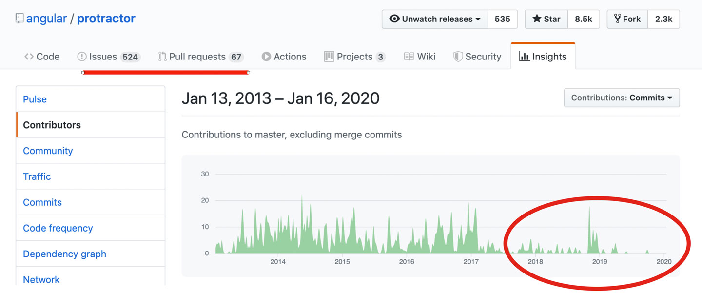

# Protractor
This folder contains a simple set up for Protractor.

> **NOTE:**\
> If you look at Protractor you can get the feeling that, in spite of all the effort that the Open Source Community is putting into it, 
> it is not being maintained by Google anymore.\
> To be honest, [I'm](https://github.com/wswebcreation) pretty sure about it. If you look at the facts, see image below, you will notice that:
> - the amount of issues is increasing
> - the amount of PR's is increasing
> - the activity in the project is decreasing
> - the last official functional release was from end of 2018 (adding support for Sauce Labs EU data center) 
>
> This is not giving me a good feeling. As a contributor to the Protractor project in the last years, I also have the feeling 
> that there won't be a big chance that this is going to change.
> I'm not the only one who thinks about Protractor like this, please take a look at [this great article](https://dev.to/davert/5-reasons-you-should-not-use-protractor-in-2019-3l4b) which might also give you some insights.\
>
> **Also be aware of the fact that Protractor DOES NOT SUPPORT W3C!** 
>
> 

## Install dependencies
You can install all dependencies by running the following command

    npm install
    
This will install all needed dependencies that are listed in the `package.json`-file

> NOTE: Make sure you are in the folder `protractor` when you execute this command

## Run tests locally
You can run the tests on your local machine, the only thing you need to have is Chrome. If you have it you can run this command

    npm run test.local

It will run all tests in *headless*-mode, meaning you will not see a browser starting, but the logs will look like this

```log
➜  protractor git:(feat/add-protractor) ✗ npm run test.local

> protractor-saucedemo@1.0.0 pretest.local /Users/wimselles/Sauce/Git/js-sauce-integrations/protractor
> npm run webdriver-update


> protractor-saucedemo@1.0.0 webdriver-update /Users/wimselles/Sauce/Git/js-sauce-integrations/protractor
> webdriver-manager update --standalone=false --gecko=false

[17:30:06] I/update - chromedriver: file exists /Users/wimselles/Sauce/Git/js-sauce-integrations/protractor/node_modules/protractor/node_modules/webdriver-manager/selenium/chromedriver_81.0.4044.69.zip
[17:30:06] I/update - chromedriver: unzipping chromedriver_81.0.4044.69.zip
[17:30:07] I/update - chromedriver: setting permissions to 0755 for /Users/wimselles/Sauce/Git/js-sauce-integrations/protractor/node_modules/protractor/node_modules/webdriver-manager/selenium/chromedriver_81.0.4044.69
[17:30:07] I/update - chromedriver: chromedriver_81.0.4044.69 up to date

> protractor-saucedemo@1.0.0 test.local /Users/wimselles/Sauce/Git/js-sauce-integrations/protractor
> protractor tests/configs/protractor.local.chrome.conf.js

[17:30:07] I/launcher - Running 8 instances of WebDriver
..[17:30:11] I/testLogger - 
------------------------------------

[17:30:11] I/testLogger - [chrome #01-1] PID: 75700
[chrome #01-1] Specs: /Users/wimselles/Sauce/Git/js-sauce-integrations/protractor/tests/specs/checkout.complete.spec.js
[chrome #01-1] 
[chrome #01-1] [17:30:07] W/driverProviders - Using driver provider directConnect, but also found extra driver provider parameter(s): seleniumAddress
[chrome #01-1] [17:30:07] I/direct - Using ChromeDriver directly...
[chrome #01-1] Jasmine started
[chrome #01-1] 
[chrome #01-1]   Checkout - Complete
[chrome #01-1]     ✓ should be able to test loading of login page
[chrome #01-1] 
[chrome #01-1] Executed 1 of 1 spec SUCCESS in 0.945 sec.

[17:30:11] I/testLogger - 

[17:30:11] I/launcher - 7 instance(s) of WebDriver still running
..........[17:30:13] I/testLogger - 
------------------------------------

[17:30:13] I/testLogger - [chrome #01-3] PID: 75702
[chrome #01-3] Specs: /Users/wimselles/Sauce/Git/js-sauce-integrations/protractor/tests/specs/checkout.summary.spec.js
[chrome #01-3] 
[chrome #01-3] [17:30:07] W/driverProviders - Using driver provider directConnect, but also found extra driver provider parameter(s): seleniumAddress
[chrome #01-3] [17:30:07] I/direct - Using ChromeDriver directly...
[chrome #01-3] Jasmine started
[chrome #01-3] 
[chrome #01-3]   Checkout - Summary
[chrome #01-3]     ✓ should validate that we can continue shopping
[chrome #01-3]     ✓ should validate that we can cancel checkout and go to the inventory page
[chrome #01-3]     ✓ should validate that we have 1 product in our checkout overview
[chrome #01-3] 
[chrome #01-3] Executed 3 of 3 specs SUCCESS in 2 secs.

[17:30:13] I/testLogger - 

[17:30:13] I/launcher - 6 instance(s) of WebDriver still running
.[17:30:13] I/testLogger - 
------------------------------------

[17:30:13] I/testLogger - [chrome #01-4] PID: 75703
[chrome #01-4] Specs: /Users/wimselles/Sauce/Git/js-sauce-integrations/protractor/tests/specs/login.spec.js
[chrome #01-4] 
[chrome #01-4] [17:30:07] W/driverProviders - Using driver provider directConnect, but also found extra driver provider parameter(s): seleniumAddress
[chrome #01-4] [17:30:07] I/direct - Using ChromeDriver directly...
[chrome #01-4] Jasmine started
[chrome #01-4] 
[chrome #01-4]   LoginPage
[chrome #01-4]     ✓ should be able to test loading of login page
[chrome #01-4]     ✓ should be able to login with a standard user
[chrome #01-4]     ✓ should not be able to login with a locked user
[chrome #01-4] 
[chrome #01-4] Executed 3 of 3 specs SUCCESS in 3 secs.

[17:30:13] I/testLogger - 

[17:30:13] I/launcher - 5 instance(s) of WebDriver still running
...[17:30:13] I/testLogger - 
------------------------------------

[17:30:13] I/testLogger - [chrome #01-2] PID: 75701
[chrome #01-2] Specs: /Users/wimselles/Sauce/Git/js-sauce-integrations/protractor/tests/specs/checkout.personal.info.spec.js
[chrome #01-2] 
[chrome #01-2] [17:30:07] W/driverProviders - Using driver provider directConnect, but also found extra driver provider parameter(s): seleniumAddress
[chrome #01-2] [17:30:07] I/direct - Using ChromeDriver directly...
[chrome #01-2] Jasmine started
[chrome #01-2] 
[chrome #01-2]   Checkout - Personal info
[chrome #01-2]     ✓ should validate we get an error if we don not provide all personal information
[chrome #01-2]     ✓ should validate that we can cancel the first checkout
[chrome #01-2]     ✓ should be able to continue the checkout
[chrome #01-2] 
[chrome #01-2] Executed 3 of 3 specs SUCCESS in 3 secs.

[17:30:13] I/testLogger - 

[17:30:13] I/launcher - 4 instance(s) of WebDriver still running
.[17:30:14] I/testLogger - 
------------------------------------

[17:30:14] I/testLogger - [chrome #01-0] PID: 75699
[chrome #01-0] Specs: /Users/wimselles/Sauce/Git/js-sauce-integrations/protractor/tests/specs/cart.summary.spec.js
[chrome #01-0] 
[chrome #01-0] [17:30:07] W/driverProviders - Using driver provider directConnect, but also found extra driver provider parameter(s): seleniumAddress
[chrome #01-0] [17:30:07] I/direct - Using ChromeDriver directly...
[chrome #01-0] Jasmine started
[chrome #01-0] 
[chrome #01-0]   Cart Summary page
[chrome #01-0]     ✓ should validate that we can continue shopping
[chrome #01-0]     ✓ should validate that we can go from the cart to the checkout page
[chrome #01-0]     ✓ should validate that a product can be removed from the cart
[chrome #01-0] 
[chrome #01-0] Executed 3 of 3 specs SUCCESS in 4 secs.

[17:30:14] I/testLogger - 

[17:30:14] I/launcher - 3 instance(s) of WebDriver still running
..[17:30:14] I/testLogger - 
------------------------------------

[17:30:14] I/testLogger - [chrome #01-6] PID: 75705
[chrome #01-6] Specs: /Users/wimselles/Sauce/Git/js-sauce-integrations/protractor/tests/specs/swag.item.details.spec.js
[chrome #01-6] 
[chrome #01-6] [17:30:08] W/driverProviders - Using driver provider directConnect, but also found extra driver provider parameter(s): seleniumAddress
[chrome #01-6] [17:30:08] I/direct - Using ChromeDriver directly...
[chrome #01-6] Jasmine started
[chrome #01-6] 
[chrome #01-6]   Swag Item Details
[chrome #01-6]     ✓ should validate that we can go back from the details to the inventory page
[chrome #01-6]     ✓ should validate that a product can be added to a cart
[chrome #01-6]     ✓ should validate that a product can be removed from the cart
[chrome #01-6] 
[chrome #01-6] Executed 3 of 3 specs SUCCESS in 4 secs.

[17:30:14] I/testLogger - 

[17:30:14] I/launcher - 2 instance(s) of WebDriver still running
...[17:30:16] I/testLogger - 
------------------------------------

[17:30:16] I/testLogger - [chrome #01-7] PID: 75706
[chrome #01-7] Specs: /Users/wimselles/Sauce/Git/js-sauce-integrations/protractor/tests/specs/swag.items.list.spec.js
[chrome #01-7] 
[chrome #01-7] [17:30:07] W/driverProviders - Using driver provider directConnect, but also found extra driver provider parameter(s): seleniumAddress
[chrome #01-7] [17:30:07] I/direct - Using ChromeDriver directly...
[chrome #01-7] Jasmine started
[chrome #01-7] 
[chrome #01-7]   Swag items list
[chrome #01-7]     ✓ should validate that all products are present
[chrome #01-7]     ✓ should validate that the details of a product can be opened
[chrome #01-7]     ✓ should validate that a product can be added to the cart
[chrome #01-7]     ✓ should validate that a product can be removed from the cart
[chrome #01-7]     ✓ should be able to open the cart summary page
[chrome #01-7] 
[chrome #01-7] Executed 5 of 5 specs SUCCESS in 4 secs.

[17:30:16] I/testLogger - 

[17:30:16] I/launcher - 1 instance(s) of WebDriver still running
...[17:30:21] I/testLogger - 
------------------------------------

[17:30:21] I/testLogger - [chrome #01-5] PID: 75704
[chrome #01-5] Specs: /Users/wimselles/Sauce/Git/js-sauce-integrations/protractor/tests/specs/menu.spec.js
[chrome #01-5] 
[chrome #01-5] [17:30:08] W/driverProviders - Using driver provider directConnect, but also found extra driver provider parameter(s): seleniumAddress
[chrome #01-5] [17:30:08] I/direct - Using ChromeDriver directly...
[chrome #01-5] Jasmine started
[chrome #01-5] 
[chrome #01-5]   Menu
[chrome #01-5]     ✓ should be able to the swag items overview page
[chrome #01-5]     ✓ should be able to open the about page
[chrome #01-5]     ✓ should be able to log out
[chrome #01-5]     ✓ should be able to clear the cart
[chrome #01-5] 
[chrome #01-5] Executed 4 of 4 specs SUCCESS in 11 secs.

[17:30:21] I/testLogger - 

[17:30:21] I/launcher - 0 instance(s) of WebDriver still running
[17:30:21] I/launcher - chrome #01-1 passed
[17:30:21] I/launcher - chrome #01-3 passed
[17:30:21] I/launcher - chrome #01-4 passed
[17:30:21] I/launcher - chrome #01-2 passed
[17:30:21] I/launcher - chrome #01-0 passed
[17:30:21] I/launcher - chrome #01-6 passed
[17:30:21] I/launcher - chrome #01-7 passed
[17:30:21] I/launcher - chrome #01-5 passed
```

## Run tests on Sauce Labs
You can run your tests on Sauce Labs US DC with this command

    npm run test.saucelabs.us

You can run your tests on Sauce Labs EU DC with this command

    npm run test.saucelabs.eu

It will spin up multiple browsers which you can find [here](./tests/configs/protractor.saucelabs.conf.js).
