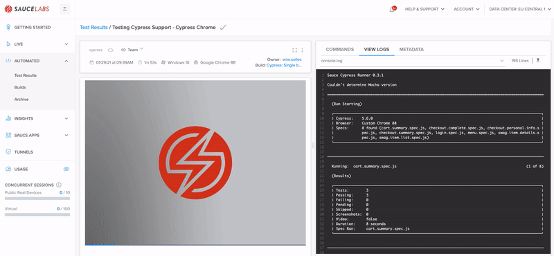

# Cypress
This folder contains a simple set up for Cypress which can be run local and with the Sauce Labs Testrunner Toolkit.

It is based on the following user journey:

1. A QA/DEV already has Cypress tests which he/she can run on his local machine, see [Run tests locally](./README.md#run-tests-locally)
1. A QA/DEV wants to use his existing tests together with the Docker infrastructure solution that Sauce Labs offers, see [Sauce Labs Testrunner Toolkit](./README.md#sauce-labs-testrunner-toolkit)
1. A QA/DEV wants to run his existing tests on Sauce Labs VMs, see [Run tests in Sauce](./README.md#run-tests-in-sauce)

Make sure you follow all steps as mentioned below.

## Intro
More information about Cypress and writing Cypress tests can be found 
[here](https://docs.cypress.io/guides/overview/why-cypress.html#In-a-nutshell)

## Local Usage
### Install dependencies
You can install all dependencies by running the following command

    npm install
    
This will install all needed dependencies that are listed in the `package.json`-file

> NOTE: Make sure you are in the folder `testrunner-toolkit/cypress` when you execute this command

### Run tests locally
You can run the tests on your local machine, the only thing you need to have is Chrome. If you have it you can run this 
command

    npm run test.local

It will run all tests in *headless*-mode, meaning you will not see a browser starting, but the logs will look like this

```log
╰ npx cypress run                        

====================================================================================================

  (Run Starting)

  ┌────────────────────────────────────────────────────────────────────────────────────────────────┐
  │ Cypress:    6.2.1                                                                              │
  │ Browser:    Electron 87 (headless)                                                             │
  │ Specs:      8 found (cart.summary.spec.js, checkout.complete.spec.js, checkout.personal.info.s │
  │             pec.js, checkout.summary.spec.js, login.spec.js, menu.spec.js, swag.item.details.s │
  │             pec.js, swag.item.list.spec.js)                                                    │
  └────────────────────────────────────────────────────────────────────────────────────────────────┘


────────────────────────────────────────────────────────────────────────────────────────────────────
                                                                                                    
  Running:  cart.summary.spec.js                                                            (1 of 8)


  Cart Summary page
    ✓ should validate that we can continue shopping (1110ms)
    ✓ should validate that we can go from the cart to the checkout page (200ms)
    ✓ should validate that a product can be removed from the cart (229ms)


  3 passing (2s)


  (Results)

  ┌────────────────────────────────────────────────────────────────────────────────────────────────┐
  │ Tests:        3                                                                                │
  │ Passing:      3                                                                                │
  │ Failing:      0                                                                                │
  │ Pending:      0                                                                                │
  │ Skipped:      0                                                                                │
  │ Screenshots:  0                                                                                │
  │ Video:        true                                                                             │
  │ Duration:     1 second                                                                         │
  │ Spec Ran:     cart.summary.spec.js                                                             │
  └────────────────────────────────────────────────────────────────────────────────────────────────┘


  (Video)

  -  Started processing:  Compressing to 32 CRF                                                     
  -  Finished processing: /Users/Sauce/Git/sauce-training/demo-js/testrunne    (0 seconds)
                          r-toolkit/cypress/cypress/videos/cart.summary.spec.js.mp4                 


────────────────────────────────────────────────────────────────────────────────────────────────────
                                                                                                    
  Running:  checkout.complete.spec.js                                                       (2 of 8)


  Checkout - Complete
    ✓ should be able to test loading of login page (326ms)


  1 passing (346ms)


  (Results)

  ┌────────────────────────────────────────────────────────────────────────────────────────────────┐
  │ Tests:        1                                                                                │
  │ Passing:      1                                                                                │
  │ Failing:      0                                                                                │
  │ Pending:      0                                                                                │
  │ Skipped:      0                                                                                │
  │ Screenshots:  0                                                                                │
  │ Video:        true                                                                             │
  │ Duration:     0 seconds                                                                        │
  │ Spec Ran:     checkout.complete.spec.js                                                        │
  └────────────────────────────────────────────────────────────────────────────────────────────────┘


  (Video)

  -  Started processing:  Compressing to 32 CRF                                                     
  -  Finished processing: /Users/Sauce/Git/sauce-training/demo-js/testrunne    (0 seconds)
                          r-toolkit/cypress/cypress/videos/checkout.complete.spec.js.               
                          mp4                                                                       


────────────────────────────────────────────────────────────────────────────────────────────────────
                                                                                                    
  Running:  checkout.personal.info.spec.js                                                  (3 of 8)


  Checkout - Personal info
    ✓ should validate we get an error if we don not provide all personal information (751ms)
    ✓ should validate that we can cancel the first checkout (234ms)
    ✓ should be able to continue the checkout (778ms)


  3 passing (2s)


  (Results)

  ┌────────────────────────────────────────────────────────────────────────────────────────────────┐
  │ Tests:        3                                                                                │
  │ Passing:      3                                                                                │
  │ Failing:      0                                                                                │
  │ Pending:      0                                                                                │
  │ Skipped:      0                                                                                │
  │ Screenshots:  0                                                                                │
  │ Video:        true                                                                             │
  │ Duration:     1 second                                                                         │
  │ Spec Ran:     checkout.personal.info.spec.js                                                   │
  └────────────────────────────────────────────────────────────────────────────────────────────────┘


  (Video)

  -  Started processing:  Compressing to 32 CRF                                                     
  -  Finished processing: /Users/Sauce/Git/sauce-training/demo-js/testrunne    (0 seconds)
                          r-toolkit/cypress/cypress/videos/checkout.personal.info.spe               
                          c.js.mp4                                                                  


────────────────────────────────────────────────────────────────────────────────────────────────────
                                                                                                    
  Running:  checkout.summary.spec.js                                                        (4 of 8)


  Checkout - Summary
    ✓ should validate that we can continue shopping (349ms)
    ✓ should validate that we can cancel checkout and go to the inventory page (383ms)
    ✓ should validate that we have 1 product in our checkout overview (140ms)


  3 passing (897ms)


  (Results)

  ┌────────────────────────────────────────────────────────────────────────────────────────────────┐
  │ Tests:        3                                                                                │
  │ Passing:      3                                                                                │
  │ Failing:      0                                                                                │
  │ Pending:      0                                                                                │
  │ Skipped:      0                                                                                │
  │ Screenshots:  0                                                                                │
  │ Video:        true                                                                             │
  │ Duration:     0 seconds                                                                        │
  │ Spec Ran:     checkout.summary.spec.js                                                         │
  └────────────────────────────────────────────────────────────────────────────────────────────────┘


  (Video)

  -  Started processing:  Compressing to 32 CRF                                                     
  -  Finished processing: /Users/Sauce/Git/sauce-training/demo-js/testrunne    (0 seconds)
                          r-toolkit/cypress/cypress/videos/checkout.summary.spec.js.m               
                          p4                                                                        


────────────────────────────────────────────────────────────────────────────────────────────────────
                                                                                                    
  Running:  login.spec.js                                                                   (5 of 8)


  LoginPage
    ✓ should be able to test loading of login page (174ms)
    ✓ should be able to login with a standard user (951ms)
    ✓ should not be able to login with a locked user (779ms)


  3 passing (2s)


  (Results)

  ┌────────────────────────────────────────────────────────────────────────────────────────────────┐
  │ Tests:        3                                                                                │
  │ Passing:      3                                                                                │
  │ Failing:      0                                                                                │
  │ Pending:      0                                                                                │
  │ Skipped:      0                                                                                │
  │ Screenshots:  0                                                                                │
  │ Video:        true                                                                             │
  │ Duration:     1 second                                                                         │
  │ Spec Ran:     login.spec.js                                                                    │
  └────────────────────────────────────────────────────────────────────────────────────────────────┘


  (Video)

  -  Started processing:  Compressing to 32 CRF                                                     
  -  Finished processing: /Users/Sauce/Git/sauce-training/demo-js/testrunne    (0 seconds)
                          r-toolkit/cypress/cypress/videos/login.spec.js.mp4                        


────────────────────────────────────────────────────────────────────────────────────────────────────
                                                                                                    
  Running:  menu.spec.js                                                                    (6 of 8)


  Menu
    ✓ should be able to the swag items overview page (885ms)
    ✓ should be able to open the about page (8095ms)
    ✓ should be able to log out (637ms)
    ✓ should be able to clear the cart (616ms)


  4 passing (10s)


  (Results)

  ┌────────────────────────────────────────────────────────────────────────────────────────────────┐
  │ Tests:        4                                                                                │
  │ Passing:      4                                                                                │
  │ Failing:      0                                                                                │
  │ Pending:      0                                                                                │
  │ Skipped:      0                                                                                │
  │ Screenshots:  0                                                                                │
  │ Video:        true                                                                             │
  │ Duration:     10 seconds                                                                       │
  │ Spec Ran:     menu.spec.js                                                                     │
  └────────────────────────────────────────────────────────────────────────────────────────────────┘


  (Video)

  -  Started processing:  Compressing to 32 CRF                                                     
  -  Finished processing: /Users/Sauce/Git/sauce-training/demo-js/testrunne     (1 second)
                          r-toolkit/cypress/cypress/videos/menu.spec.js.mp4                         


────────────────────────────────────────────────────────────────────────────────────────────────────
                                                                                                    
  Running:  swag.item.details.spec.js                                                       (7 of 8)


  Swag Item Details
    ✓ should validate that we can go back from the details to the inventory page (606ms)
    ✓ should validate that a product can be added to a cart (304ms)
    ✓ should validate that a product can be removed from the cart (408ms)


  3 passing (1s)


  (Results)

  ┌────────────────────────────────────────────────────────────────────────────────────────────────┐
  │ Tests:        3                                                                                │
  │ Passing:      3                                                                                │
  │ Failing:      0                                                                                │
  │ Pending:      0                                                                                │
  │ Skipped:      0                                                                                │
  │ Screenshots:  0                                                                                │
  │ Video:        true                                                                             │
  │ Duration:     1 second                                                                         │
  │ Spec Ran:     swag.item.details.spec.js                                                        │
  └────────────────────────────────────────────────────────────────────────────────────────────────┘


  (Video)

  -  Started processing:  Compressing to 32 CRF                                                     
  -  Finished processing: /Users/Sauce/Git/sauce-training/demo-js/testrunne    (0 seconds)
                          r-toolkit/cypress/cypress/videos/swag.item.details.spec.js.               
                          mp4                                                                       


────────────────────────────────────────────────────────────────────────────────────────────────────
                                                                                                    
  Running:  swag.item.list.spec.js                                                          (8 of 8)


  Swag items list
    ✓ should validate that all products are present (436ms)
    ✓ should validate that the details of a product can be opened (301ms)
    ✓ should validate that a product can be added to the cart (288ms)
    ✓ should validate that a product can be removed from the cart (336ms)
    ✓ should be able to open the cart summary page (301ms)


  5 passing (2s)


  (Results)

  ┌────────────────────────────────────────────────────────────────────────────────────────────────┐
  │ Tests:        5                                                                                │
  │ Passing:      5                                                                                │
  │ Failing:      0                                                                                │
  │ Pending:      0                                                                                │
  │ Skipped:      0                                                                                │
  │ Screenshots:  0                                                                                │
  │ Video:        true                                                                             │
  │ Duration:     1 second                                                                         │
  │ Spec Ran:     swag.item.list.spec.js                                                           │
  └────────────────────────────────────────────────────────────────────────────────────────────────┘


  (Video)

  -  Started processing:  Compressing to 32 CRF                                                     
  -  Finished processing: /Users/Sauce/Git/sauce-training/demo-js/testrunne    (0 seconds)
                          r-toolkit/cypress/cypress/videos/swag.item.list.spec.js.mp4               


====================================================================================================

  (Run Finished)


       Spec                                              Tests  Passing  Failing  Pending  Skipped  
  ┌────────────────────────────────────────────────────────────────────────────────────────────────┐
  │ ✔  cart.summary.spec.js                     00:01        3        3        -        -        - │
  ├────────────────────────────────────────────────────────────────────────────────────────────────┤
  │ ✔  checkout.complete.spec.js                340ms        1        1        -        -        - │
  ├────────────────────────────────────────────────────────────────────────────────────────────────┤
  │ ✔  checkout.personal.info.spec.js           00:01        3        3        -        -        - │
  ├────────────────────────────────────────────────────────────────────────────────────────────────┤
  │ ✔  checkout.summary.spec.js                 895ms        3        3        -        -        - │
  ├────────────────────────────────────────────────────────────────────────────────────────────────┤
  │ ✔  login.spec.js                            00:01        3        3        -        -        - │
  ├────────────────────────────────────────────────────────────────────────────────────────────────┤
  │ ✔  menu.spec.js                             00:10        4        4        -        -        - │
  ├────────────────────────────────────────────────────────────────────────────────────────────────┤
  │ ✔  swag.item.details.spec.js                00:01        3        3        -        -        - │
  ├────────────────────────────────────────────────────────────────────────────────────────────────┤
  │ ✔  swag.item.list.spec.js                   00:01        5        5        -        -        - │
  └────────────────────────────────────────────────────────────────────────────────────────────────┘
    ✔  All specs passed!                        00:19       25       25        -        -        - 
```

You can also run the test in *headfull*-mode with this command

    npm run test.local.headfull
    
You will then see Chrome poping up.

## Sauce Labs Testrunner Toolkit
### Install dependencies

Follow instructions from [here](https://github.com/saucelabs/testrunner-toolkit)

> NOTE: Make sure you are in the folder `testrunner-toolkit/cypress` when you execute this command

### Run tests in Sauce

    npx saucectl run
    
    # OR
    npm run test.docker.sauce

It will run all tests and the logs will look like this

```log
╰ npm run test.docker.sauce                
   
   > cypress-1@1.0.0 test.docker.sauce /Users/wimselles/Sauce/Git/sauce-training/demo-js/testrunner-toolkit/cypress
   > npx saucectl run
   
   11:50:31 INF Running version 0.27.1
   11:50:31 INF Reading config file config=.sauce/config.yml
   11:50:31 INF Running Cypress in Docker
   11:50:31 INF Setting up test environment
   11:50:32 INF File mounted from=cypress.json to=/home/seluser/cypress.json
   11:50:32 INF File mounted from=cypress to=/home/seluser/cypress
   11:50:32 INF Using credentials set by environment variables
   11:50:32 INF Starting container id=046b32756883 img=saucelabs/stt-cypress-mocha-node:v5.6.0
   
   > sauce-cypress-runner@5.6.0 test /home/seluser
   > ./bin/cypress "-r" "/home/seluser/sauce-runner.json" "-s" "Cypress Chrome"
   
   Sauce Cypress Runner 5.6.0
   It looks like this is your first time using Cypress: 5.6.0
   
   [11:50:33]  Verifying Cypress can run /home/seluser/.cache/Cypress/5.6.0/Cypress [started]
   [11:50:35]  Verified Cypress!       /home/seluser/.cache/Cypress/5.6.0/Cypress [title changed]
   [11:50:35]  Verified Cypress!       /home/seluser/.cache/Cypress/5.6.0/Cypress [completed]
   
   Opening Cypress...
   Couldn't find tsconfig.json. tsconfig-paths will be skipped
   
   tput: No value for $TERM and no -T specified
   ================================================================================
   
     (Run Starting)
   
     ┌────────────────────────────────────────────────────────────────────────────────────────────────┐
     │ Cypress:    5.6.0                                                                              │
     │ Browser:    Chrome 81                                                                          │
     │ Specs:      8 found (cart.summary.spec.js, checkout.complete.spec.js, checkout.personal.info.s │
     │             pec.js, checkout.summary.spec.js, login.spec.js, menu.spec.js, swag.item.details.s │
     │             pec.js, swag.item.list.spec.js)                                                    │
     └────────────────────────────────────────────────────────────────────────────────────────────────┘
   
   
   ────────────────────────────────────────────────────────────────────────────────────────────────────
                                                                                                       
     Running:  cart.summary.spec.js                                                            (1 of 8)
   
     (Results)
   
     ┌────────────────────────────────────────────────────────────────────────────────────────────────┐
     │ Tests:        3                                                                                │
     │ Passing:      3                                                                                │
     │ Failing:      0                                                                                │
     │ Pending:      0                                                                                │
     │ Skipped:      0                                                                                │
     │ Screenshots:  0                                                                                │
     │ Video:        true                                                                             │
     │ Duration:     1 second                                                                         │
     │ Spec Ran:     cart.summary.spec.js                                                             │
     └────────────────────────────────────────────────────────────────────────────────────────────────┘
   
   
   ────────────────────────────────────────────────────────────────────────────────────────────────────
                                                                                                       
     Running:  checkout.complete.spec.js                                                       (2 of 8)
   
     (Results)
   
     ┌────────────────────────────────────────────────────────────────────────────────────────────────┐
     │ Tests:        1                                                                                │
     │ Passing:      1                                                                                │
     │ Failing:      0                                                                                │
     │ Pending:      0                                                                                │
     │ Skipped:      0                                                                                │
     │ Screenshots:  0                                                                                │
     │ Video:        true                                                                             │
     │ Duration:     0 seconds                                                                        │
     │ Spec Ran:     checkout.complete.spec.js                                                        │
     └────────────────────────────────────────────────────────────────────────────────────────────────┘
   
   
   ────────────────────────────────────────────────────────────────────────────────────────────────────
                                                                                                       
     Running:  checkout.personal.info.spec.js                                                  (3 of 8)
   
     (Results)
   
     ┌────────────────────────────────────────────────────────────────────────────────────────────────┐
     │ Tests:        3                                                                                │
     │ Passing:      3                                                                                │
     │ Failing:      0                                                                                │
     │ Pending:      0                                                                                │
     │ Skipped:      0                                                                                │
     │ Screenshots:  0                                                                                │
     │ Video:        true                                                                             │
     │ Duration:     2 seconds                                                                        │
     │ Spec Ran:     checkout.personal.info.spec.js                                                   │
     └────────────────────────────────────────────────────────────────────────────────────────────────┘
   
   
   ────────────────────────────────────────────────────────────────────────────────────────────────────
                                                                                                       
     Running:  checkout.summary.spec.js                                                        (4 of 8)
   
     (Results)
   
     ┌────────────────────────────────────────────────────────────────────────────────────────────────┐
     │ Tests:        3                                                                                │
     │ Passing:      3                                                                                │
     │ Failing:      0                                                                                │
     │ Pending:      0                                                                                │
     │ Skipped:      0                                                                                │
     │ Screenshots:  0                                                                                │
     │ Video:        true                                                                             │
     │ Duration:     1 second                                                                         │
     │ Spec Ran:     checkout.summary.spec.js                                                         │
     └────────────────────────────────────────────────────────────────────────────────────────────────┘
   
   
   ────────────────────────────────────────────────────────────────────────────────────────────────────
                                                                                                       
     Running:  login.spec.js                                                                   (5 of 8)
   
     (Results)
   
     ┌────────────────────────────────────────────────────────────────────────────────────────────────┐
     │ Tests:        3                                                                                │
     │ Passing:      3                                                                                │
     │ Failing:      0                                                                                │
     │ Pending:      0                                                                                │
     │ Skipped:      0                                                                                │
     │ Screenshots:  0                                                                                │
     │ Video:        true                                                                             │
     │ Duration:     2 seconds                                                                        │
     │ Spec Ran:     login.spec.js                                                                    │
     └────────────────────────────────────────────────────────────────────────────────────────────────┘
   
   
   ────────────────────────────────────────────────────────────────────────────────────────────────────
                                                                                                       
     Running:  menu.spec.js                                                                    (6 of 8)
   
     (Results)
   
     ┌────────────────────────────────────────────────────────────────────────────────────────────────┐
     │ Tests:        3                                                                                │
     │ Passing:      3                                                                                │
     │ Failing:      0                                                                                │
     │ Pending:      0                                                                                │
     │ Skipped:      0                                                                                │
     │ Screenshots:  0                                                                                │
     │ Video:        true                                                                             │
     │ Duration:     2 seconds                                                                        │
     │ Spec Ran:     menu.spec.js                                                                     │
     └────────────────────────────────────────────────────────────────────────────────────────────────┘
   
   
   ────────────────────────────────────────────────────────────────────────────────────────────────────
                                                                                                       
     Running:  swag.item.details.spec.js                                                       (7 of 8)
   
     (Results)
   
     ┌────────────────────────────────────────────────────────────────────────────────────────────────┐
     │ Tests:        3                                                                                │
     │ Passing:      3                                                                                │
     │ Failing:      0                                                                                │
     │ Pending:      0                                                                                │
     │ Skipped:      0                                                                                │
     │ Screenshots:  0                                                                                │
     │ Video:        true                                                                             │
     │ Duration:     1 second                                                                         │
     │ Spec Ran:     swag.item.details.spec.js                                                        │
     └────────────────────────────────────────────────────────────────────────────────────────────────┘
   
   
   ────────────────────────────────────────────────────────────────────────────────────────────────────
                                                                                                       
     Running:  swag.item.list.spec.js                                                          (8 of 8)
   
     (Results)
   
     ┌────────────────────────────────────────────────────────────────────────────────────────────────┐
     │ Tests:        5                                                                                │
     │ Passing:      5                                                                                │
     │ Failing:      0                                                                                │
     │ Pending:      0                                                                                │
     │ Skipped:      0                                                                                │
     │ Screenshots:  0                                                                                │
     │ Video:        true                                                                             │
     │ Duration:     2 seconds                                                                        │
     │ Spec Ran:     swag.item.list.spec.js                                                           │
     └────────────────────────────────────────────────────────────────────────────────────────────────┘
   
   
   ================================================================================
   
     (Run Finished)
   tput: No value for $TERM and no -T specified
   
   
          Spec                                              Tests  Passing  Failing  Pending  Skipped  
     ┌────────────────────────────────────────────────────────────────────────────────────────────────┐
     │ ✔  cart.summary.spec.js                     00:01        3        3        -        -        - │
     ├────────────────────────────────────────────────────────────────────────────────────────────────┤
     │ ✔  checkout.complete.spec.js                545ms        1        1        -        -        - │
     ├────────────────────────────────────────────────────────────────────────────────────────────────┤
     │ ✔  checkout.personal.info.spec.js           00:02        3        3        -        -        - │
     ├────────────────────────────────────────────────────────────────────────────────────────────────┤
     │ ✔  checkout.summary.spec.js                 00:01        3        3        -        -        - │
     ├────────────────────────────────────────────────────────────────────────────────────────────────┤
     │ ✔  login.spec.js                            00:02        3        3        -        -        - │
     ├────────────────────────────────────────────────────────────────────────────────────────────────┤
     │ ✔  menu.spec.js                             00:02        3        3        -        -        - │
     ├────────────────────────────────────────────────────────────────────────────────────────────────┤
     │ ✔  swag.item.details.spec.js                00:01        3        3        -        -        - │
     ├────────────────────────────────────────────────────────────────────────────────────────────────┤
     │ ✔  swag.item.list.spec.js                   00:02        5        5        -        -        - │
     └────────────────────────────────────────────────────────────────────────────────────────────────┘
       ✔  All specs passed!                        00:13       24       24        -        -        -  
   
   Detected inconsistent video sizes.
   Using /home/seluser/__assets__/cart.summary.spec.js.mp4 as the main video.
   
   Open job details page: https://app.eu-central-1.saucelabs.com/tests/4cfb0f58bb214983bdbfa1c89e9cccd1
   
   11:51:22 INF Command Finished ExitCode=0
   11:51:22 INF Tearing down environment
```

### Browser support
We support Chrome by default, but if you want to run on Firefox please add the following to the
 [config](./.sauce/config.yml)

```yaml
capabilities:
  - browserName: firefox
```

### Running tests on Sauce Labs cloud
You can also run Cypress tests on Sauce Labs VM's with the following command:

```bash
npx saucectl run --test-env sauce

# OR
npm run test.sauce
```

which will result in this



Want to start running cypress tests on Sauce Labs cloud ? Join our beta program: [https://info.saucelabs.com/scale-cypress-testing.html](https://info.saucelabs.com/scale-cypress-testing.html). 

#### Run tests in parallel
> Concurrency with saucectl is tied to the test suites field in your .sauce/config.yml.
>For example if you have ten .spec files split across two test suites, and you set --ccy to 10, the max concurrency is 2.

You can also run your tests in parallel by running the following command

```bash
# The DATE variable is to give the build name a unique name in Sauce Labs like `Cypress: parallel - Fri Jan 29 09:54:18 CET 2021`
DATE="$(date)" npx saucectl run --config .sauce/config-suites.yml --test-env sauce --ccy 4

# OR
npm run test.sauce.parallel
```

#### Run tests in parallel on different browsers
> Concurrency with saucectl is tied to the test suites field in your .sauce/config.yml.
>For example if you have ten .spec files split across two test suites, and you set --ccy to 10, the max concurrency is 2.

You can also run your tests in parallel with different browsers by running the following command

```bash
# The DATE variable is to give the build name a unique name in Sauce Labs like `Cypress: Multiple Browsers - Fri Jan 29 09:47:16 CET 2021`
DATE="$(date)" npx saucectl run --config .sauce/config-suites-browsers.yml --test-env sauce --ccy 15

# OR
npm run test.sauce.browsers
```
