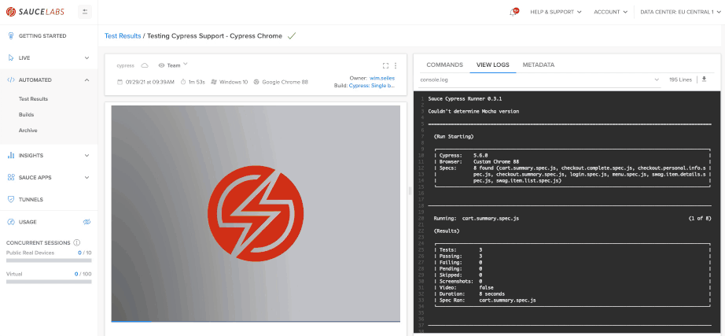

# Cypress default set up
This folder contains a simple set up for Cypress which can be run locally, in a docker container and on Sauce Labs with 
the [Sauce Labs Testrunner Toolkit](https://docs.saucelabs.com/testrunner-toolkit/index.html).

Make sure you follow all steps as mentioned below.

## Local Usage
### Install dependencies
You can install all dependencies by running the following command

    npm install
    
This will install all needed dependencies that are listed in the `package.json`-file

### Run tests locally
You can run the tests on your local machine, the only thing you need to have is Chrome. If you have it you can run this 
command

    npm run test.local

It will run all tests in *headless*-mode, meaning you will not see a browser starting, but the logs will look like this

<details>
 <summary>Click to expand and see the logs.</summary>
 
```log
 ╰ npx cypress run                        
 
 ====================================================================================================
 
   (Run Starting)
 
   ┌────────────────────────────────────────────────────────────────────────────────────────────────┐
   │ Cypress:    6.2.1                                                                              │
   │ Browser:    Electron 87 (headless)                                                             │
   │ Specs:      8 found (cart.summary.spec.js, checkout.complete.spec.js, checkout.personal.info.s │
   │             pec.js, checkout.summary.spec.js, login.spec.js, menu.spec.js, swag.item.details.s │
   │             pec.js, swag.item.list.spec.js)                                                    │
   └────────────────────────────────────────────────────────────────────────────────────────────────┘
 
 
 ────────────────────────────────────────────────────────────────────────────────────────────────────
                                                                                                     
   Running:  cart.summary.spec.js                                                            (1 of 8)
 
 
   Cart Summary page
     ✓ should validate that we can continue shopping (1110ms)
     ✓ should validate that we can go from the cart to the checkout page (200ms)
     ✓ should validate that a product can be removed from the cart (229ms)
 
 
   3 passing (2s)
 
 
   (Results)
 
   ┌────────────────────────────────────────────────────────────────────────────────────────────────┐
   │ Tests:        3                                                                                │
   │ Passing:      3                                                                                │
   │ Failing:      0                                                                                │
   │ Pending:      0                                                                                │
   │ Skipped:      0                                                                                │
   │ Screenshots:  0                                                                                │
   │ Video:        true                                                                             │
   │ Duration:     1 second                                                                         │
   │ Spec Ran:     cart.summary.spec.js                                                             │
   └────────────────────────────────────────────────────────────────────────────────────────────────┘
 
 
   (Video)
 
   -  Started processing:  Compressing to 32 CRF                                                     
   -  Finished processing: /Users/Sauce/Git/sauce-training/demo-js/testrunne    (0 seconds)
                           r-toolkit/cypress/cypress/videos/cart.summary.spec.js.mp4                 
 
 
 //...........              
 
 
 ====================================================================================================
 
   (Run Finished)
 
 
        Spec                                              Tests  Passing  Failing  Pending  Skipped  
   ┌────────────────────────────────────────────────────────────────────────────────────────────────┐
   │ ✔  cart.summary.spec.js                     00:01        3        3        -        -        - │
   ├────────────────────────────────────────────────────────────────────────────────────────────────┤
   │ ✔  checkout.complete.spec.js                340ms        1        1        -        -        - │
   ├────────────────────────────────────────────────────────────────────────────────────────────────┤
   │ ✔  checkout.personal.info.spec.js           00:01        3        3        -        -        - │
   ├────────────────────────────────────────────────────────────────────────────────────────────────┤
   │ ✔  checkout.summary.spec.js                 895ms        3        3        -        -        - │
   ├────────────────────────────────────────────────────────────────────────────────────────────────┤
   │ ✔  login.spec.js                            00:01        3        3        -        -        - │
   ├────────────────────────────────────────────────────────────────────────────────────────────────┤
   │ ✔  menu.spec.js                             00:10        4        4        -        -        - │
   ├────────────────────────────────────────────────────────────────────────────────────────────────┤
   │ ✔  swag.item.details.spec.js                00:01        3        3        -        -        - │
   ├────────────────────────────────────────────────────────────────────────────────────────────────┤
   │ ✔  swag.item.list.spec.js                   00:01        5        5        -        -        - │
   └────────────────────────────────────────────────────────────────────────────────────────────────┘
     ✔  All specs passed!                        00:19       25       25        -        -        - 
 ```
</details>

You can also run the test in *headfull*-mode with this command

    npm run test.local.headfull
    
You will then see Chrome popping up.

## Sauce Labs Testrunner Toolkit
### Install dependencies
Follow instructions from [here](https://docs.saucelabs.com/testrunner-toolkit/installation)

### Run tests with Docker and Sauce
Make sure you've installed Docker on your local machine or in your pipeline, see also 
[this](https://docs.saucelabs.com/testrunner-toolkit/installation) page.

You can then run this project with

    npx saucectl run
    
    # OR
    npm run test.docker.sauce

It will run all tests and the logs will look like this

<details>
 <summary>Click to expand and see the logs.</summary>

```log
╰ npm run test.docker.sauce                
   
   > cypress-1@1.0.0 test.docker.sauce /Users/Sauce/Git/sauce-training/demo-js/testrunner-toolkit/cypress
   > npx saucectl run
   
   11:50:31 INF Running version 0.27.1
   11:50:31 INF Reading config file config=.sauce/config.yml
   11:50:31 INF Running Cypress in Docker
   11:50:31 INF Setting up test environment
   11:50:32 INF File mounted from=cypress.json to=/home/seluser/cypress.json
   11:50:32 INF File mounted from=cypress to=/home/seluser/cypress
   11:50:32 INF Using credentials set by environment variables
   11:50:32 INF Starting container id=046b32756883 img=saucelabs/stt-cypress-mocha-node:v5.6.0
   
   > sauce-cypress-runner@5.6.0 test /home/seluser
   > ./bin/cypress "-r" "/home/seluser/sauce-runner.json" "-s" "Cypress Chrome"
   
   Sauce Cypress Runner 5.6.0
   It looks like this is your first time using Cypress: 5.6.0
   
   [11:50:33]  Verifying Cypress can run /home/seluser/.cache/Cypress/5.6.0/Cypress [started]
   [11:50:35]  Verified Cypress!       /home/seluser/.cache/Cypress/5.6.0/Cypress [title changed]
   [11:50:35]  Verified Cypress!       /home/seluser/.cache/Cypress/5.6.0/Cypress [completed]
   
   Opening Cypress...
   Couldn't find tsconfig.json. tsconfig-paths will be skipped
   
   tput: No value for $TERM and no -T specified
   ================================================================================
   
     (Run Starting)
   
     ┌────────────────────────────────────────────────────────────────────────────────────────────────┐
     │ Cypress:    5.6.0                                                                              │
     │ Browser:    Chrome 81                                                                          │
     │ Specs:      8 found (cart.summary.spec.js, checkout.complete.spec.js, checkout.personal.info.s │
     │             pec.js, checkout.summary.spec.js, login.spec.js, menu.spec.js, swag.item.details.s │
     │             pec.js, swag.item.list.spec.js)                                                    │
     └────────────────────────────────────────────────────────────────────────────────────────────────┘
   
   
   ────────────────────────────────────────────────────────────────────────────────────────────────────
                                                                                                       
     Running:  cart.summary.spec.js                                                            (1 of 8)
   
     (Results)
   
     ┌────────────────────────────────────────────────────────────────────────────────────────────────┐
     │ Tests:        3                                                                                │
     │ Passing:      3                                                                                │
     │ Failing:      0                                                                                │
     │ Pending:      0                                                                                │
     │ Skipped:      0                                                                                │
     │ Screenshots:  0                                                                                │
     │ Video:        true                                                                             │
     │ Duration:     1 second                                                                         │
     │ Spec Ran:     cart.summary.spec.js                                                             │
     └────────────────────────────────────────────────────────────────────────────────────────────────┘
   
   
//..................................
   
   
   ================================================================================
   
     (Run Finished)
   tput: No value for $TERM and no -T specified
   
   
          Spec                                              Tests  Passing  Failing  Pending  Skipped  
     ┌────────────────────────────────────────────────────────────────────────────────────────────────┐
     │ ✔  cart.summary.spec.js                     00:01        3        3        -        -        - │
     ├────────────────────────────────────────────────────────────────────────────────────────────────┤
     │ ✔  checkout.complete.spec.js                545ms        1        1        -        -        - │
     ├────────────────────────────────────────────────────────────────────────────────────────────────┤
     │ ✔  checkout.personal.info.spec.js           00:02        3        3        -        -        - │
     ├────────────────────────────────────────────────────────────────────────────────────────────────┤
     │ ✔  checkout.summary.spec.js                 00:01        3        3        -        -        - │
     ├────────────────────────────────────────────────────────────────────────────────────────────────┤
     │ ✔  login.spec.js                            00:02        3        3        -        -        - │
     ├────────────────────────────────────────────────────────────────────────────────────────────────┤
     │ ✔  menu.spec.js                             00:02        3        3        -        -        - │
     ├────────────────────────────────────────────────────────────────────────────────────────────────┤
     │ ✔  swag.item.details.spec.js                00:01        3        3        -        -        - │
     ├────────────────────────────────────────────────────────────────────────────────────────────────┤
     │ ✔  swag.item.list.spec.js                   00:02        5        5        -        -        - │
     └────────────────────────────────────────────────────────────────────────────────────────────────┘
       ✔  All specs passed!                        00:13       24       24        -        -        -  
   
   Detected inconsistent video sizes.
   Using /home/seluser/__assets__/cart.summary.spec.js.mp4 as the main video.
   
   Open job details page: https://app.eu-central-1.saucelabs.com/tests/4cfb0f58bb214983bdbfa1c89e9cccd1
   
   11:51:22 INF Command Finished ExitCode=0
   11:51:22 INF Tearing down environment
```
</details>

The test will be executed in a Docker container, but the results will be pushed to Sauce Labs.

### Running tests on the Sauce Labs cloud
You can also run Cypress tests on Sauce Labs VM's with the following command:

```bash
npx saucectl run --test-env sauce

# OR for use with the EU data center

npm run test.sauce.eu

# OR for use with the US data center
npm run test.sauce.us
```

which will result in this


